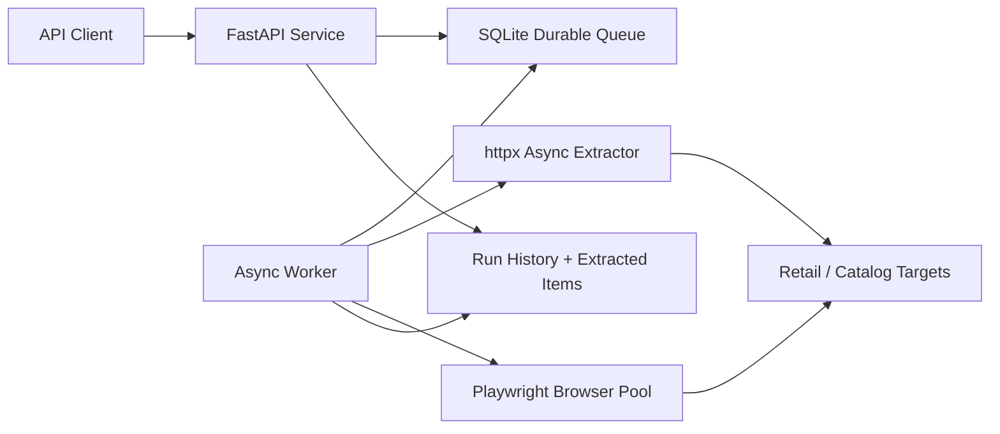

# Price Intelligence Platform

[](https://github.com/tayyabnasir01112-debug/price-intelligence-platform/actions/workflows/ci.yml)


Production-grade async extraction service for price intelligence, catalog monitoring, and structured web data collection.

This repository is designed as a senior Python portfolio project: it is installable, typed, tested, Dockerized, CI-backed, and built around failure-tolerant async data collection rather than one-off scraping scripts.

## What It Demonstrates

- FastAPI service layer with typed request and response schemas.
- Async HTTP extraction through `httpx.AsyncClient`.
- Controlled Playwright browser pool for JavaScript-heavy targets.
- SQLite-backed durable task queue and persistent run history using SQLAlchemy async ORM.
- Pydantic configuration schemas for strict target validation.
- Retry budgets, proxy rotation hooks, session/user-agent rotation, and safe missing-selector handling.
- Structured JSON logs, health endpoint, worker process, Docker image, and test suite.
- Strict quality gates with Ruff, Mypy, Pytest, and GitHub Actions.

## Architecture



The service separates request validation, queue leasing, extraction, persistence, and API reporting. A submitted run creates durable queue tasks. Workers lease tasks, execute HTTP or browser extraction with bounded concurrency, persist extracted values and error boundaries, then update run-level status.

## Production-Oriented Design

- **Durable queue leasing:** tasks are stored in SQLite with `pending`, `leased`, `succeeded`, and `dead` states so work can be recovered after worker interruption.
- **Bounded concurrency:** HTTP extraction and browser contexts use semaphores to avoid unbounded resource usage.
- **Error boundaries:** missing selectors and transient network failures are persisted as task results instead of crashing the process.
- **Retry budgets:** each target can define its own retry budget, allowing high-value targets to tolerate more transient failures.
- **Typed configuration:** Pydantic models validate selectors, extractors, timeouts, headers, proxies, and request metadata.
- **Operational visibility:** `/health`, run status endpoints, structured JSON logs, and CI checks make the service inspectable.

## Repository Layout

```text
price-intelligence-platform/
|-- src/price_intel/
|   |-- api/                 # FastAPI routers and dependency wiring
|   |-- database.py          # Async engine/session/bootstrap
|   |-- extractors.py        # HTTP and browser extraction engines
|   |-- logging.py           # JSON logging
|   |-- main.py              # FastAPI app factory
|   |-- orm.py               # SQLAlchemy persistence models
|   |-- proxies.py           # Proxy and identity rotation helpers
|   |-- queue.py             # SQLite-backed durable queue
|   |-- schemas.py           # Pydantic API/config schemas
|   |-- service.py           # Extraction orchestration service
|   `-- worker.py            # Long-running worker loop
|-- tests/
|-- configs/
|-- Dockerfile
|-- pyproject.toml
`-- .env.example
```

## Local Setup

```bash
python -m venv .venv
. .venv/Scripts/activate  # Windows PowerShell: .\.venv\Scripts\Activate.ps1
python -m pip install -U pip
pip install -e ".[dev]"
playwright install chromium
copy .env.example .env
```

Run the API:

```bash
uvicorn price_intel.main:app --reload
```

Run a worker:

```bash
price-intel-worker
```

Run tests and quality checks:

```bash
pytest
ruff check .
mypy src
```

## Example Request

```bash
curl -X POST http://localhost:8000/runs \
  -H "Content-Type: application/json" \
  -d @configs/example_request.json
```

Check status:

```bash
curl http://localhost:8000/runs/<run_id>
curl http://localhost:8000/runs/<run_id>/items
```

## Docker

```bash
docker build -t price-intel .
docker run --rm -p 8000:8000 --env-file .env price-intel
```

## API Surface

- `GET /health` verifies service and database availability.
- `POST /runs` submits one extraction run with one or more validated targets.
- `POST /workers/process` leases and processes queued tasks, useful for local demos and operational control.
- `GET /runs/{run_id}` returns run status and task counts.
- `GET /runs/{run_id}/items` returns extracted structured data and per-target errors.

## Roadmap

- Alembic migrations for schema evolution.
- `docker-compose.yml` profile with Postgres.
- Optional Playwright integration test marker for browser-backed extraction.
- OpenTelemetry traces and Prometheus metrics export.

